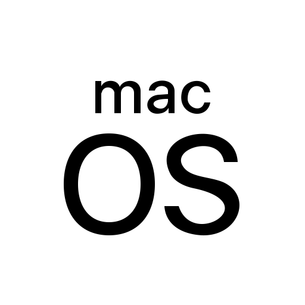

# Hi! I'm Majid

- Interested in Fintech, Blockchain and Quantitative Trading
- Expert in Python, Pandas, SQL, Machine Learning, and more
- Blockchain and smart contracts are next on the list
- 2022 Goals: Create a cryptocurrency and several trading bots 🤖

### Connect with me:

### Languages, Tools & Systems:

    
    
     
    
      
      
    
    
        
            
    
    
    
    
    
    

### Some of my stats:

